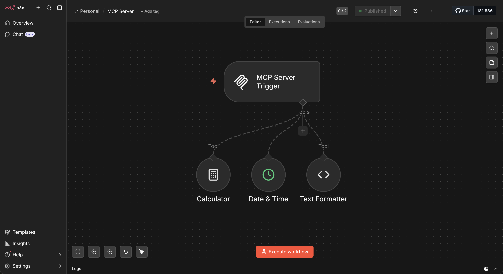
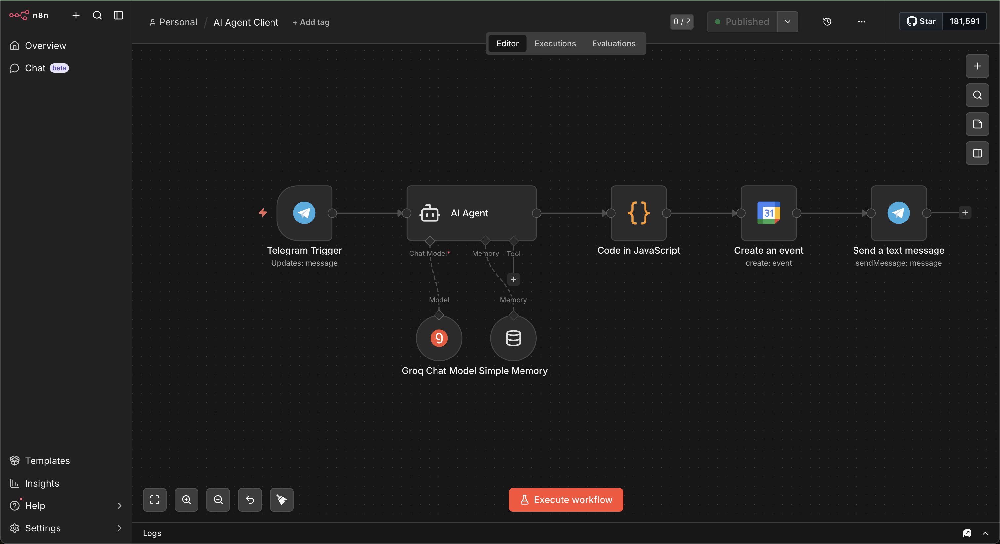
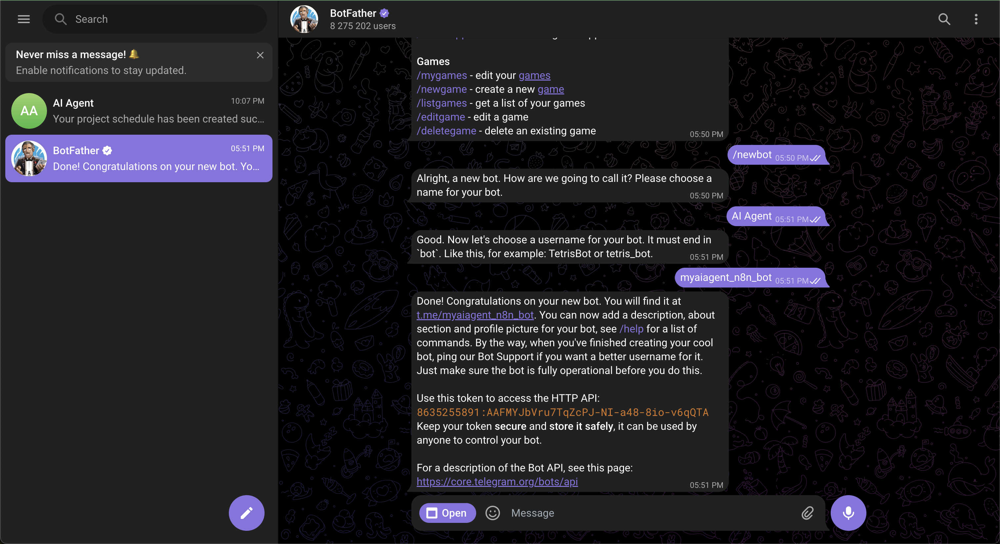
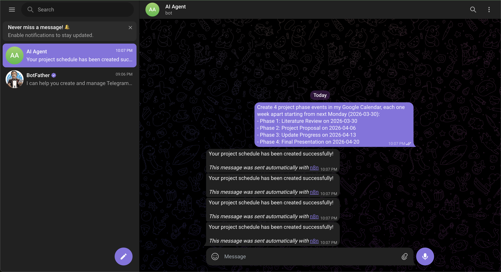
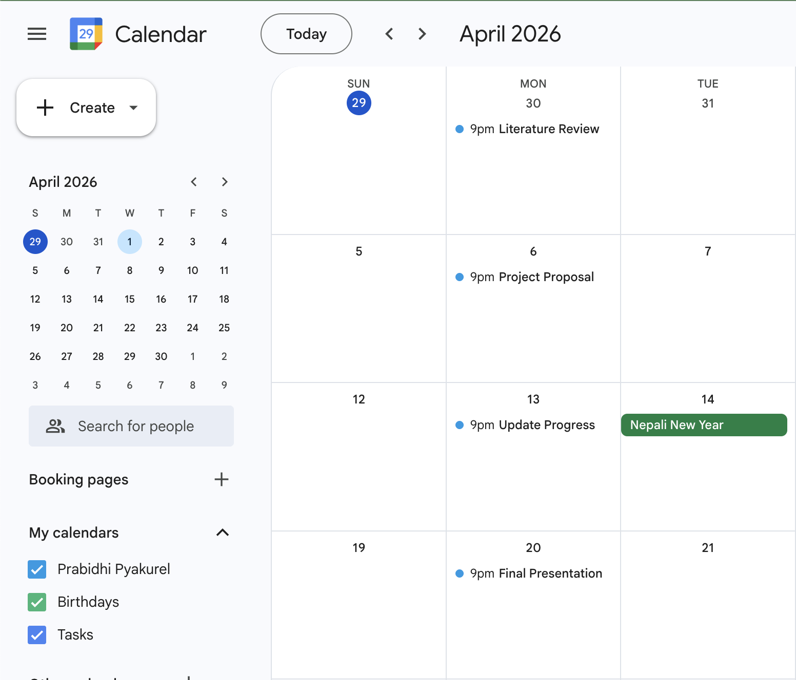

# A7: MCP-Server, AI Agent, and External Tool Integration

This assignment involved building an integrated AI Agent ecosystem using the Model Context Protocol (MCP) in n8n, deployed locally via Docker and exposed to the internet using ngrok. The goal was to create an agent that can handle real-world tasks like managing Google Calendar events and communicating through Telegram.

---

## Task 1: MCP Infrastructure & Server Setup

### Server Deployment

n8n was run locally using Docker and exposed to the internet using ngrok, making the Production URL publicly accessible for webhook communication. The Docker container was configured with the ngrok URL set as both the editor base URL and webhook URL so that all production endpoints resolved correctly.

### MCP Server Workflow

A dedicated n8n workflow was created to act as the MCP Server. It uses an MCP Server Trigger connected to three internal tools: a Calculator, a Date & Time node, and a custom Text Formatter built using a Code node. Once published, the workflow exposes a Production URL (SSE endpoint) that any MCP Client can connect to and discover the available tools.

### AI Agent Workflow

A separate AI Agent workflow was created using a Chat Trigger as the entry point. The agent was configured with:
- **Groq** (`llama-3.3-70b-versatile`) as the free LLM
- **Simple Memory** for maintaining conversation context across messages
- **MCP Client** connected to the MCP Server's Production URL to access the three tools

### Verification — Agent Using MCP Tools

The agent was tested through the n8n built-in chat interface. Each tool was verified by sending a relevant message and confirming the agent called the correct tool and returned the right result.

#### 1. Calculator

#### 2. Date and Time

#### 3. Text Formatter (Uppercase)

#### 4. Memory — Recalling a previous message

---

## Task 2: Telegram & Google Calendar Integration

### Overview

The AI Agent workflow was extended to work with Telegram and Google Calendar. The Chat Trigger was replaced with a Telegram Trigger so the agent can receive and reply to real messages. A Google Calendar tool was also added so the agent can create and manage events directly from a conversation.

### Agent Workflow

The updated workflow consists of:
- **Telegram Trigger** — listens for incoming messages from the Telegram bot
- **AI Agent** — processes the message and decides which tools to use
- **Groq Chat Model** — the LLM powering the agent
- **Simple Memory** — maintains context across the conversation
- **MCP Client** — connected to the MCP Server tools
- **Google Calendar** — used to create, read, and manage calendar events
- **Telegram Send Message** — sends the agent's reply back to the user on Telegram

### Setting Up the Telegram Bot

The Telegram bot was created using BotFather. The bot token was then added as a credential in n8n and connected to the Telegram Trigger node.

### Automated Project Scheduling

The agent was tested by sending a command via Telegram to create a project schedule with four phases in Google Calendar. The agent successfully created all four events on separate dates.

- 1st Phase: Literature Review
- 2nd Phase: Project Proposal
- 3rd Phase: Update Progress
- 4th Phase: Final (Presentation)

The agent also responded back on Telegram confirming the events were created, and was able to answer follow-up questions about the schedule.

### Google Calendar — Created Events

All four project phase events were verified in Google Calendar after the Telegram command was sent.

